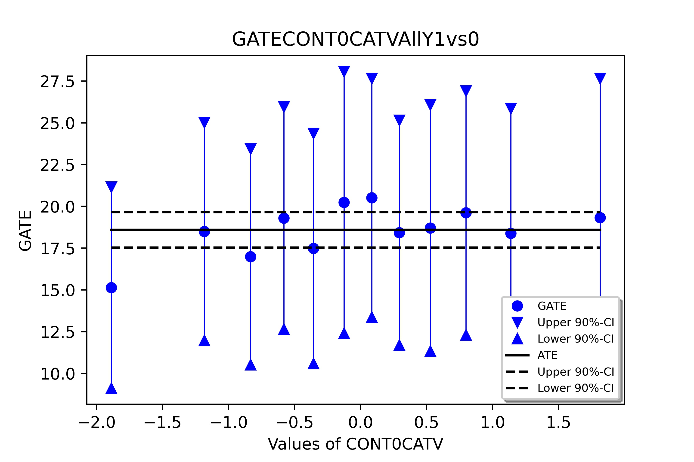
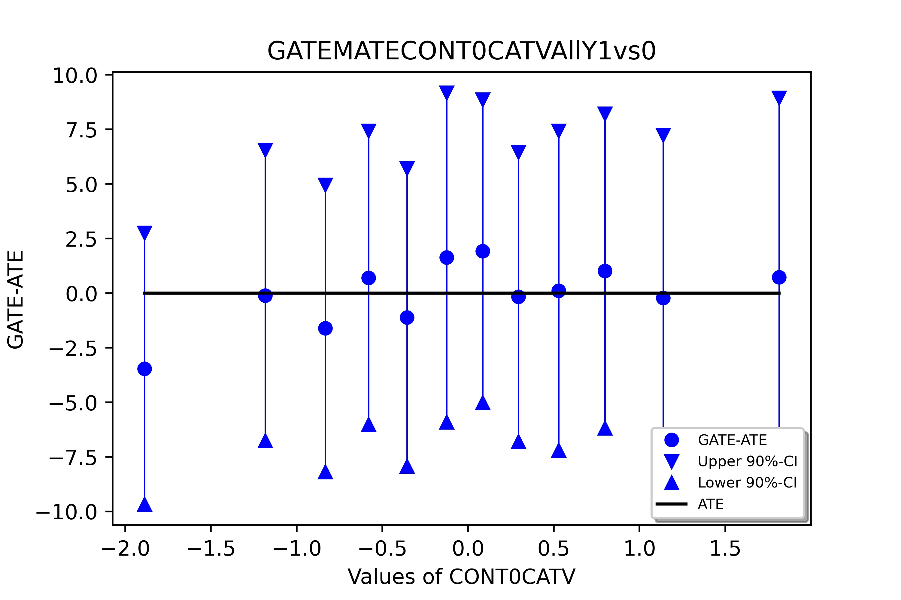
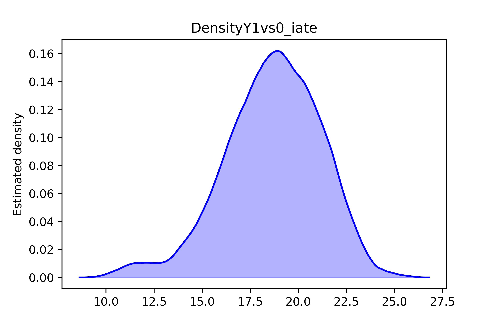

# Tutorial 1

## Scope

The *learning goals* of this tutorial are as follows:

1. Understand the basic functionality of the `mcf` module.
2. Understand the output from the `mcf` module.

For this purpose, we use the synthetic data, *dgp_mcfN4000S5*, which is provided [here](https://github.com/MCFpy/mcf/tree/main/data). The data includes information on 4,000 observations in form of 120 continuous, 10 categorical, 10 dummy, and 10 ordered features. In addition, the data includes information on treatment status, $D$, which can take one of four values $D \in \{0, 1, 2, 3\}$ and the realized outcome, $Y$.

For the subsequent code to work, make sure that the path to the data file is correctly specified.

```python
import mcf
import pandas as pd
data = pd.read_csv('dgp_mcfN4000S5.csv')
```

You may wish to inspect the structure of the data by running the command `data.head()`.

## Getting started

 As listed in [section Python API](./core_6.md), most of the argument inputs of the the `mcf` function take default values. With two exceptions we will stick to most default values. Accordingly, we start the program as follows:

```python
import mcf

outpfad = 'your/output/goes/here'
datpfad = 'your/data/is/here'

indata = 'dgp_mcfN4000S5'           # csv for estimation

d_name = ['d']          # Treatment
y_name = ['y']          # List of outcome variables
x_name_ord = ['cont0', 'cont1']
z_name_list = ['cont0']
mp_parallel = 8
mp_with_ray = False   
```

By setting `mp_parallel = 8`, we set the number of parallel processes to 8. Further, we set `mp_with_ray = False`. In small-scale applications, we weakly prefer the concurrent futures module over ray for multiprocessing. For a more detailed discussion on parallel computing in the `mcf` package consult section (Technical Appendix)[./techn_app.md].

Finally, to execute the program, we run the following code chunk.  

```python
if __name__ == '__main__':
    mcf.mcf_functions.ModifiedCausalForest(
        outpfad=outpfad, datpfad=datpfad, indata=indata,
        d_name=d_name, y_name=y_name, x_name_ord=x_name_ord, z_name_list = z_name_list,mp_parallel = mp_parallel, mp_with_ray = mp_with_ray)
```

The above code gives you an easy starting point for your own application! For this purpose, adjust the provided code along the required dimensions. For example, your treatment and outcome variables may be denoted differently in your data. Probably also your data file has a different name.

Running the above code took roughly 6 minutes on a laptop, equipped with 8 logical cores and 16 GB of RAM. The table below shows the time the programme took for the different steps.

|Step | Duration |
| -- | --|
Data preparation and stats I:     | 0 min 1 sec
Local centering (recoding of Y):  | 0 min 0 sec
Data preparation and stats II:    | 0 mic 16 sec
Feature preselection:             | 0 min 0 sec
Estimate forest structure:        | 3 min 38 sec
Variable importance:               | 0 min 0 sec
Fill tree with outcomes:          | 0 min 8 sec
Common support:                   | 0 min 1 sec  
Weight computation:               | 1 min 1 sec
Inference for ATEs:               | 0 min 1 sec
Inference for MGATE & AMGATE:     | 0 min 0 sec
Inference for GATEs:              | 0 min 23 sec
Inference for IATEs:              | 0 min 33 sec
Balancing test:                   | 0 min 0 sec
Post estimation analysis:         | 0 min 10 sec
Total time:                       | 6 min 14 sec

Now, we are ready to proceed and discuss the output.

## Output

As delineated in section [MCF Walkthrough](./part_i.md) the results from running the `mcf` program are made available in a folder called  ***out***. By default, the folder comprises (i) a text document, which summarizes descriptive statistics and results on estimation and inference, (ii) figure-related output, and (iii) a file *Predpred.csv*, which stores predicted effects and standard errors for all units. Note that the figure-related output is organised into three folders *fig_csv*, *fig_jpeg*, and *fig_pdf*, which comprise *csv* data files, *jpeg*, and *pdf* plots of the results. The directory *fig_csv* provides a convenient tool to generate figures with your preferred software and in your preferred style.


By default the file with the text output is named **indat** + ".txt". At the very beginning of this text file, we are presented with all parameter values which are used for the MCF estimation. Next, we are presented with summary statistics of our data for all included columns. Included statistics comprise:

1. count
2. mean
3. standard deviation
4. minimum
5. 25th percentile
6. median
7. 75th percentile
8. maximum

Note that the program records already a categorial version of the ordered continuous feature, CONT0CATV , for which we take interest in computing the GATEs. The new variable comprises 12 categories.

By default, the programme checks for  unnecessary variables and observations with missings. Such variables and observations are deleted with corresponding records in the output file. In our example,

>  No observations deleted
>  
>  157  variables deleted: CAT0 CAT1 CAT2 CAT3 CAT4 CAT5 ...

The output then renders again summary statistics against the data, which is used further down the road. In our example, we obtain the following summary snippet:


| |          count   |      mean   |       std |      min   |      25%  |        50%      |    75%    |      max |
|--|--|--|--|--|--|--|--|--|
|Y    |      4000.0 | 42.309155|  27.251202 |-12.888671  |18.906933 | 38.363192  |61.711783  |119.762925|
D      |    4000.0   |1.500000 |  1.118174 |  0.000000  | 0.750000  | 1.500000  | 2.250000   | 3.000000|
CONT0CATV | 4000.0  |-0.025826|   0.989230  |-1.888354  |-0.643319 | -0.020565 |  0.595218  |  1.814788|
CONT0  |    4000.0  |-0.025826  | 1.004082 | -3.630159  |-0.696858 | -0.018953  | 0.655045   | 3.341817|
CONT1   |   4000.0 | -0.008695  | 0.996335  |-3.570143  |-0.689161|  -0.000960  | 0.687441  |  4.153693|

Next, the output summarises how the *indat* is split into *‌tree_sample_tmp.csv* and *‌fill_y_sample_tmp.csv*, which are required for the honest tree building; by default, the sample is split into equally large halves:

>Random sample splitting
Number of obs. in org. data /Users/hannah/Documents/Coding/MCFpy/out/_tempmcf_/indata2_temp.csv  4000
Number of obs. in /Users/hannah/Documents/Coding/MCFpy/out/_tempmcf_/tree_sample_tmp.csv  2000
Number of obs. in /Users/hannah/Documents/Coding/MCFpy/out/_tempmcf_/fill_y_sample_tmp.csv  2000

Next, we are presented with a comparison of the outcome *Y* for each treatment status pair. Latter exercise facilitates a quick check on statistically significant differences between the respective treatment groups. As example the pairwise comparison for treatments 3 and 1 is given in the table below. From this result we conclude that the outcome variable is significantly different at the 5 percent level for the two groups.


|Variable      |                    Mean  |     Std  |       t-val  | p-val (%)| Stand.Difference (%)|
|--|--|--|--|--|--|
|Y    |                            48.39970    |0.54982   |  88.03    |  0.00  |  393.67 |

Next, the output file summarises the features used to build the causal forest, which boils down to *CONT0*, *CONT1*, *CONT0CATV*. After this, we receive  info on matched neighbours of variable used for tree building. For instance, comparing treatments $D =3$ versus $D=1$:

|Variable              |            Mean    |   Std     |    t-val |  p-val (%)| Stand.Difference (%)|
|--|--|--|--|--|--|
|Y_NN0 |                            0.29476  |  0.37128    |  0.79 |    42.73   |   4.95|
Y_NN1  |                          -0.09330  |  0.50964 |     0.18   |  85.47   |  -1.14|
Y_NN2      |                       1.00274  |  0.68342  |    1.47   |  14.23    |  9.14|
Y_NN3   |                          0.14475 |   0.94619     | 0.15  |   87.84   |   0.95|

By adhering to the defaults, we have included a grid search over $\alpha$. The corresponding results are summarised in the table below. Measured by the OOB value, which is the sum of the MSE and MCE, the specification with the lowest OOB value wins and is selected for further computations. In our instance, this corresponds to an $\alpha$ value of 0.2.

|Number of vars | min. leaf size | alpha reg. |OOB value |Trees without OOB|
|--|--|--|--|--|
|1  |          5     |       0.100  |518891.188 |    0|
1      |      5     |       0.200  |518668.681  |   0|
2    |        5    |        0.100  |525253.565  |   0|
2     |       5     |       0.200  |527363.336|     0        |   

For latter specification (a minimum leaf size of 5 and $\alpha = 0.2$) the forest obtains as:

1. Parameters of estimation to build random forest
2. Outcome variable used to build forest:   Y
3. Features used to build forest:           CONT0 CONT1 CONT0CATV
4. Variables always included in splitting:
5. Number of replications:     1000
6. Splitting rule used:        MSE+MCE criterion
7. Penalty used in splitting:  3696.208353813115
8. Share of data in subsample: 0.6395514623745527
9. Total number of variables available for splitting: 3   

11. Minimum leaf size:                 5   
12. Alpha regularity:                 0.200

with the subsequent structure:

| | |
|--|--|
|Average # of leaves:    |  118.7|
|Average size of leaves: |  10.8|
|Median size of leaves:   | 10.0|
|Min size of leaves:      |    5|
|Max size of leaves:       |  51|
|Total no. of obs in leaves:| 1279|


Adhering to the principal of honesty, the program continuous to assign observations from the *‌fill_y_sample_tmp.csv* to the appropriate cells for further estimation. The output summarizes the  common support analysis. Estimation methods adjusting for differences in features require common support in all treatment arms. Hence, units considered to be off support are dropped. In our application, the upper limits on the respective treatment probabilities are given by [0.55571439 0.54827745 0.58607963 0.56150745] and the lower limits on treatment probabilities:  [0.00671384 0.03575506 0.03189171 0.03126602]. This led to 78  (3.900%) observations being deleted.

Subsequently, results on the weights estimation are rendered.  The weights are informative on how many observations effectively drive the estimation results.

In the output snippet given below, for treatment 1,
out of  2000 observations  525 have strictly positive weights. Note that due to honesty and our split of the original data into two equally sized data sets for tree growing and tree filling, we are left with 2000 and not 4000 observations.  


 Example: Treatment group: 0

1. No. of weights > 0: 525    
2. No.of weights = 0: 1475   ,
3. Mean of positive weights:  0.0019
4. Std. of positive weights:  0.0007
5. Gini coefficient (incl. weights=0):                         78.2324%
6. Gini coefficient (weights > 0):                             17.0758%
7. Share of 1% / 5% / 10% largest weights of all weights > 0:   3.9021% 11.1618% 18.0577%

Next, the output comprises information analysis of the different treatment effects, which have been defined [here](./part_i.md#Estimation).

1. ATE, ATETs
2. GATEs
2. IATEs

Note that as we have not specified any variables under $z$, the program cannot compute the GATEs  Marginal GATEs, and AMGATEs.

Below, the ATEs are given, which all exhibit high t-values and hence are all significant at standard significance levels:

| Comparison  |  Estimate  | Standard error | t-value  | p-value  |
|--|--|--|--| --|
|1   vs   0 |   18.593801   |   0.648874   | 28.66     |0.000% ****|
|2   vs   0 |   38.961063    |  0.859293   | 45.34    | 0.000% ****|
|3   vs   0  |  66.598374   |   1.246965  |  53.41  |   0.000% ****|
|2   vs   1  |  20.367262   |   0.963418   | 21.14  |   0.000% ****|
|3   vs   1 |   48.004574   |   1.320875  |  36.34   |  0.000% ****|
|3   vs   2  |  27.637312   |   1.435987 |   19.25 |    0.000% ****|


Next, the GATE related output is rendered, including an analysis of the weights. The table below presents the estimated GATE for the 12 categories of *CONT0CATV* for a comparison of treatment $D = 1$ versus $D = 0$. The $Z$ column summarizes to which value of $Z$ the presented GATE corresponds to. The column GATE-ATE summarizes the differences between the GATE and ATE. We see that None of the estimated GATE is significantly different from the ATE at standard significance levels.    

|Comparison |  Z  |   GATE   |   SE |  t-val |  p-val  |      GATE-ATE    |    SE   | t-val |p-val|
|--|--|--|--|--|--|--|--|--|--|
|1   vs   0 | -1.9| 15.13573 |  3.66640|  4.13 |  0.00% **** |-3.45807 |  3.77997 | 0.91 | 36.03% |
|1   vs   0 | -1.2 | 18.49357 |  3.96904 | 4.66  | 0.00% **** |-0.10023  | 4.04580  |0.02|  98.02%  |
|1   vs   0 | -0.8 |16.98334 |  3.93248|  4.32 |  0.00% ****| -1.61046|   3.99926 | 0.40 | 68.72%  |
|1   vs   0|  -0.6| 19.30235 |  4.04546 | 4.77  | 0.00% ****|  0.70855  | 4.08998  |0.17 | 86.25%  |
|1   vs   0 | -0.4 |17.48490 |  4.19075|  4.17 |  0.00% **** |-1.10890 |  4.14809  |0.27 | 78.92%|  
|1   vs   0 | -0.1 |20.23756 |  4.76856 | 4.24 |  0.00% **** | 1.64376 |  4.58583 | 0.36  |72.00%  |
|1   vs   0 |  0.1| 20.51924 |  4.34376 | 4.72 |  0.00% **** | 1.92544|   4.21845 | 0.46 | 64.81%  |
|1   vs   0 |  0.3 |18.42825 |  4.09588 | 4.50   |0.00% **** |-0.16555 |  4.02912 |  0.04 | 96.72%  |
|1   vs   0 |  0.5 |18.70971 |  4.48377 | 4.17  | 0.00% ****|  0.11591|   4.44885 | 0.03 | 97.92%  |
|1   vs   0 |  0.8| 19.60946|   4.44035|  4.42 |  0.00% ****  |1.01566  | 4.37612|  0.23 | 81.65%|  
|1   vs   0 |  1.1| 18.38255|   4.54971 | 4.04  | 0.01% **** |-0.21125 |  4.53110 | 0.05  |96.28%  |
|1   vs   0 |  1.8 |19.33045 |  5.06202 | 3.82 |  0.01% ****  |0.73665  | 4.99228 | 0.15|  88.27% |

The figures below represent the same results visually. Figure 1 shows the GATE for the 12 categories of *CONT0CATV* and figure 2 for the respective difference of GATE - ATE. Confidence intervals are indicated by the blue bars:






The IATEs measure the mean impact of treatment $m$ compared to treatment $l$ for units with features $x$. The IATEs represent the estimands at the finest aggregation level of features available. The program estimates IATEs for each unit in the prediction sample without the need of specifying any input arguments. Amidst the IATEs the script includes a comparison of the IATE minus ATE. This difference allows us to evaluate whether the IATE is significantly different from the ATE. Below we include the table including the difference of the IATE and the IATE minus the ATE:

Descriptives for IATE estimation

|Comparison  |   Mean    |  Median     | Std   |Effect > 0 |mean(SE)  |sig 10% |sig 5% | sig 1%|
|--|--|--|--|--|--|--|--|--|
|1   vs   0|   18.65602  | 18.79430   | 2.47341 |100.00%    |6.20815| 100.00% | 99.95% | 90.22%|
|2   vs   0  | 39.02920  | 39.22721 |   2.61906 |100.00%  |  9.71184 |100.00%| 100.00% |100.00%|
|3   vs   0  | 66.71884 |  66.84773 |   5.33019 |100.00% |  14.96710 |100.00%| 100.00%| 100.00%|
|2   vs   1 |  20.37317   |20.44566  |  3.20066 |100.00%  | 11.04250 | 76.69% | 33.30%  | 1.66%|
|3   vs   1 |  48.06282 |  47.97006 |   4.76105 |100.00%  | 15.86336| 100.00%| 100.00% | 92.98%|
|3   vs   2 |  27.68965|   27.89650|    5.04739| 100.00%  | 17.54441 | 44.95% |  8.22%   |0.00%|

IATE minus ATE with corresponding statistics  (weights not censored)

|Comparison  |   Mean    |  Median     | Std   |Effect > 0 |mean(SE)  |sig 10% |sig 5% | sig 1%|
|--|--|--|--|--|--|--|--|--|
|1   vs   0 |   0.00000 |   0.14418   | 3.17937|  51.98%   | 9.38841  | 0.26%  | 0.00%|   0.00%|
|2   vs   0  |  0.00000  |  0.19037    |3.59386|  52.39% |  14.73598 |  0.00% |  0.00%   |0.00%|
|3   vs   0  |  0.00000   | 0.09806 |   6.11682  |50.57%  | 22.82174 |  0.00% |  0.00%  | 0.00%|
|2   vs   1  |  0.00000  |  0.04268  |  4.21012 | 50.31%   |16.84435  | 0.00%  | 0.00% |  0.00%|
|3   vs   1 |   0.00000   | 0.46545 |   5.65407|  52.55%  | 24.23930  | 0.00%  | 0.00% |  0.00%|
|3   vs   2   | 0.00000  |  0.36732|    5.97842  |52.71%  | 26.85144  | 0.00% |  0.00% |  0.00%|

From this table we conclude that the IATEs are not statistically significantly from the ATE for any treatment comparison at standard significance levels. The two figures below visually encode the respective distribution of the IATE (1 vs 0) and the IATE of the observations in ascending order of the IATE.




Subsequently, the script renders the results from the [post estimation analysis ](./part_i.md). The binary correlation analysis computes dependencies among the IATEs, as well as between the IATEs and the potential (weighted) outcomes, and between the IATEs and the features.

For instance, consider the IATE for the treatment 1 versus 0 (Y1vs0_iate): Then, we observe the following correlations of the IATE and the outcomes/potential outcomes/features. From this table we conclude that a high IATE is associated with a lower potential outcome for treatment 0:

| | Correlation in percent|
|--|--|
|Y1vs0_iate      |       100.00|
|Y2vs0_iate      |        21.09|
|Y3vs0_iate       |       44.98|
|Y0_pot             |    -14.60|
|Y1_pot              |    86.98|
|Y2_pot             |      12.58|
|Y3_pot             |      39.44|
|CONT0               |    33.02|
|CONT1 |38.85|

By default, the the program applies k-Means clustering to  analyze the heterogeneity in different groups. It uses the k-means++ algorithm. Clusters are formed on the IATEs only. For these clusters, descriptive statistics are displayed of the IATEs, the potential outcome, and the features. A snippet from the corresponding output for the clustering of effects is provided below for the effects:

|Effects | 0     |     1   |       2    |      3   |4|
|--|--|--|--|--|--|   
|Y1vs0_iate  |15.748146 | 17.651687 | 20.171823 | 18.972415  |20.086383|
|Y2vs0_iate  |38.436916  |35.167916 | 39.116544 | 39.614274  |41.051560|
|Y3vs0_iate | 59.399062  |65.575303 | 63.648580 | 69.083618  |73.774896|

and for the features

|Feature |0   |      1      |   2    |     3  |       4|
|--|--|--|--|--|--|
|CONT0 |-1.019301 |-0.141751 |-0.204567  |0.275242 | 0.706707|
|CONT1 |-0.614990 |-0.710015 | 0.231552 | 0.252568  |0.516563|


In the last step, the outputs prints the results from the post estimation random forest for the IATEs. The procedure builds a predictive random forest to learn major features influencing the IATEs. The feature importance measures are presented in percentage points of the coefficient of determination $R^2$ lost when randomizing single features.
